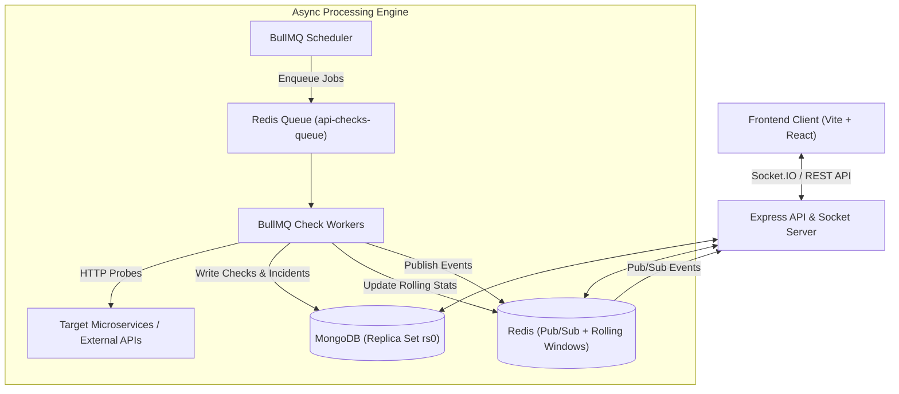

# 🛡️ SentryWatch — Developer-First API Health Observability Platform

SentryWatch is a high-throughput, multi-tenant API health check and anomaly detection system engineered for fast-moving engineering teams. It provides deterministic HTTP health probing, rolling statistical anomaly detection, automated incident management, and real-time Socket.IO updates.

---

## 📐 Architecture Overview



---

## ✨ Key Features

- **Multi-Tenant Isolation**: Tenant boundaries strictly enforced at database and socket room levels (`org:<orgId>`).
- **Deterministic HTTP Health Probing**: Configurable check intervals (60s, 300s, 900s) with 10s strict timeout enforcement.
- **Idempotency Guard**: Database-enforced compound index `{ apiId: 1, scheduledTime: 1 }` preventing duplicate check insertions during worker retries or crashes.
- **Rolling Window Anomaly Detection**: Pure functional anomaly evaluation comparing recent failure rates and latency against a 20-check rolling window baseline.
- **2-Cycle Incident Guard**: Prevents alert fatigue by requiring 2 consecutive anomaly cycles before transitioning status to `critical` and spawning an Incident.
- **Real-Time Live Dashboard**: Socket.IO room subscriptions dynamically pushing `api:status_changed`, `incident:created`, and `incident:updated` directly to active client sessions.

---

## 🚀 Quick Start (Local Development)

### 1. Prerequisites
- Docker & Docker Compose installed
- Node.js v20+ and `npm`

### 2. Clone & Install Dependencies
```bash
# Clone repository
git clone https://github.com/your-org/sentrywatch.git
cd sentrywatch

# Install backend dependencies
cd backend && npm install

# Install frontend dependencies
cd ../frontend && npm install
```

### 3. Start Database & Cache Services
```bash
# Start MongoDB (Replica Set rs0) and Redis via Docker
docker compose up -d mongo redis
```

### 4. Seed Demo Data
```bash
cd backend
npm run seed
```
*Seeds default organization `Acme Corp Engineering` and default admin user `admin@sentrywatch.com` / `password123`.*

### 5. Start Backend & Frontend Dev Servers
```bash
# Terminal 1: Backend API & Workers
cd backend && npm run dev

# Terminal 2: Frontend Client
cd frontend && npm run dev
```

Open `http://localhost:5173` in your browser.

---

## 🧪 Testing

```bash
# Run backend unit test suite
cd backend && npm test
```

---

## 🔮 Future Improvements
- **Email verification & 2FA** — out of scope for MVP; requires an email/SMS provider we don't have yet.
- **Refresh token revocation** — logout currently clears the httpOnly cookie only; a stolen refresh JWT remains valid until expiry. A server-side denylist or rotation scheme belongs in a later hardening pass.

---

## 📜 License

MIT License. Designed and built with performance, security, and developer ergonomics in mind.
